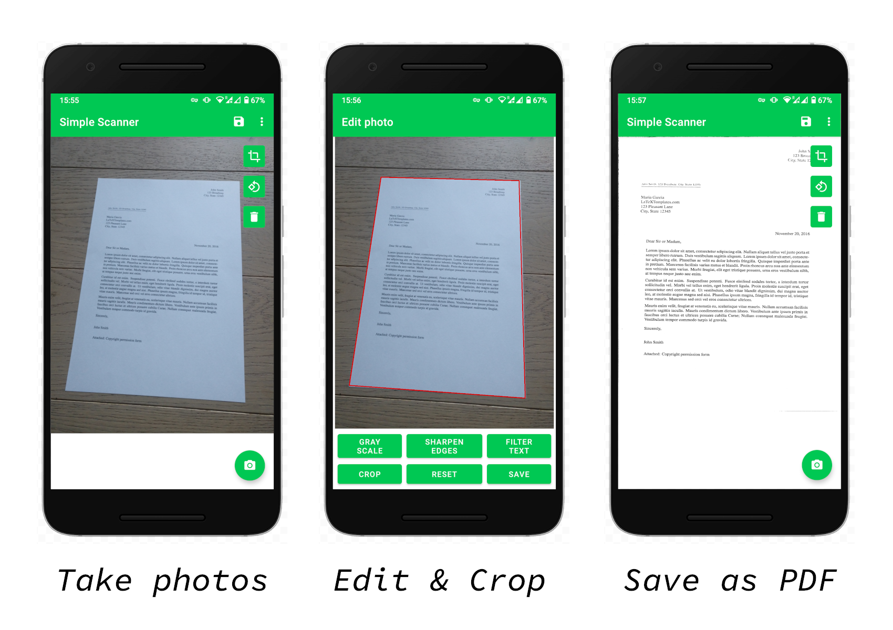

# Simple scanner app for Android

You've found a project of mine to learn Android development in Java! The app is fully functional, see below, but the code has serious design flaws because it does not correctly respect the [activity lifecycle](https://developer.android.com/guide/components/activities/activity-lifecycle).

### Dependencies

- [BoofCV](https://boofcv.org/) for image processing tasks (remove perspective distortion, adaptive threshold algorithm, ...)
- [PDFBox for Android](https://github.com/TomRoush/PdfBox-Android) for PDF processing tasks (embedding images in the PDF, ...)
